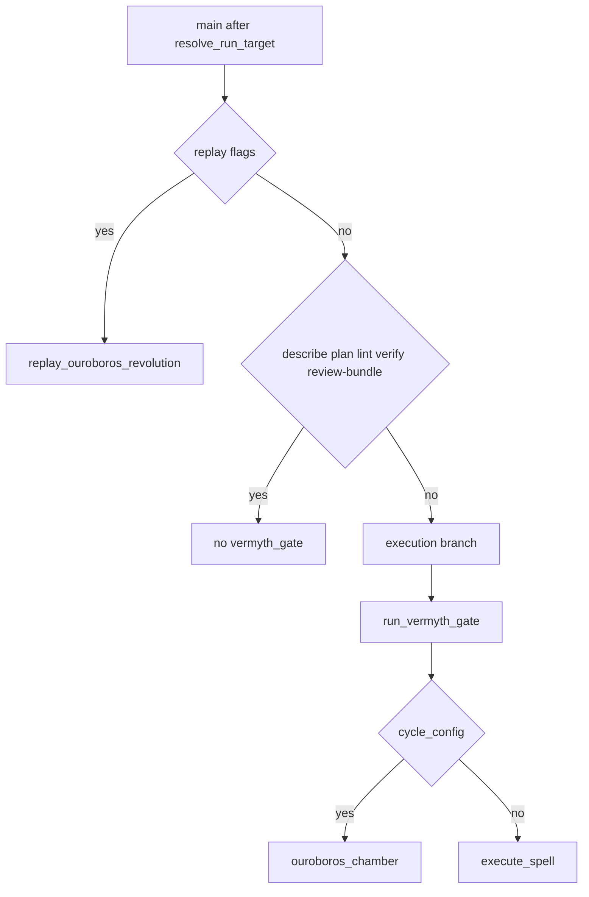

# CLI contracts (stability reference)

This document describes **current** command-line behavior for automation and CI. It is not a feature specification; behavior changes should be paired with tests and release notes.

## Invocation

Supported entrypoints:

| Method | Example |
|--------|---------|
| Repository shim | `python axiomurgy.py <target> [options]` (run from clone; resolves via script path) |
| Module | `python -m axiomurgy <target> [options]` |
| Package API | `from axiomurgy.cli import main` then `raise SystemExit(main(sys.argv[1:]))` |

Install the package in editable mode so `import axiomurgy` resolves (`pip install -e ".[dev]"` from the repository root).

Schemas and the default policy are loaded from **`axiomurgy/bundled/`** inside the installed package (wheel-safe). Repository-root copies of the same JSON files are **mirrors** of bundled content; see [CONTRACT_FILES.md](CONTRACT_FILES.md) for the canonical source of truth and sync instructions.

## Default artifact directory

When `--artifact-dir` is omitted, the runtime uses `DEFAULT_ARTIFACT_DIR` from `axiomurgy.util`: `ROOT / "artifacts"`, where `ROOT` is the parent directory of the `axiomurgy` package (`Path(__file__).resolve().parent.parent` from `util.py`).

- In a **checkout** (editable install), `ROOT` is typically the repository root, so artifacts default to `<repo>/artifacts/` (often gitignored).
- In a **plain install** under `site-packages`, `ROOT` is the parent of `site-packages/axiomurgy`, so the default directory is a sibling `artifacts/` folder next to `site-packages`. That location is easy to misread or misplace; for installs outside a dev tree, pass **`--artifact-dir`** explicitly to a directory you control.

This documents current behavior; it is not a recommendation to rely on the default in production.

## Streams

- **Success paths** and most **handled errors** use `print(...)` to **stdout**.
- **stderr** is typically empty for normal CLI operation. (Uncaught exceptions may write tracebacks to stderr.)

## Exit codes (`main()` return value)

| Code | Meaning |
|------|---------|
| 0 | Normal completion. For execution modes, the result JSON may still include `"status": "failed"` for a failed spell run; the process exits 0 unless an exception escapes the handler below. |
| 1 | Handled exception types (e.g. validation, `AxiomurgyError`, JSON decode errors, HTTP errors from adapters). Error line: `ERROR: ...` on **stdout**. |
| 2 | Missing target, bad flag combinations, or CLI usage errors. `ERROR: ...` on **stdout**. |
| 3 | `--verify-review-bundle` when status is not `exact`/`partial`; Ouroboros replay drift. |
| 4 | Ouroboros replay `non_replayable`. |

## Structured failure without nonzero exit

- **`--lint`**: Invalid JSON may produce `"ok": false` and structured `errors` with exit code **0**.
- **Execution** (`execute_spell` via CLI): Failed runs often return JSON with `"status": "failed"` and exit code **0** unless an exception is raised during orchestration.

Shell scripts should not rely on exit code alone for execution success; inspect JSON `"status"` (and spellbook-specific fields) when needed.

## Path resolution

Targets and `--policy` / `--artifact-dir` paths are resolved by the runtime; tests should pass **absolute paths** when `cwd` is not the repository root.

## Optional Vermyth integration (additive)

Full gate semantics, attestation notes, and replay/Ouroboros divergence are documented in [VERMYTH_GATE.md](VERMYTH_GATE.md).

- **Environment**: `AXIOMURGY_VERMYTH_BASE_URL` (or `VERMYTH_BASE_URL`) — Vermyth HTTP adapter base (e.g. `http://127.0.0.1:7777/`). `AXIOMURGY_VERMYTH_TIMEOUT_MS` overrides HTTP client timeout (default 5000).
- **`--export-vermyth-program PATH`**: writes a standalone `vermyth_program_export` JSON document and exits (no `--plan` / `--describe` / `--lint` / `--review-bundle`).
- **`--vermyth-program`**: with `--plan` or `--review-bundle`, adds `vermyth_program_export` to the plan JSON.
- **`--vermyth-validate`**: adds `vermyth_program_preview` (Vermyth `compile_program` response slice) when a base URL is set.
- **`--vermyth-recommendations`**: adds `semantic_recommendations` (advisory; may be `unavailable` without a server). Baseline compare / pin policy: [SEMANTIC_RECOMM_VERMYTH_PIN.md](SEMANTIC_RECOMM_VERMYTH_PIN.md), workflow [`.github/workflows/semantic_recommend_baseline.yml`](../.github/workflows/semantic_recommend_baseline.yml).
- **`--vermyth-receipt`**: with execution + witness recording, also writes `*.vermyth_receipt.json` (unsigned cross-reference). Alternatively `AXIOMURGY_VERMYTH_RECEIPT=1`.
- **Policy** `vermyth_gate`: see [VERMYTH_GATE.md](VERMYTH_GATE.md).
- **Culture memory**: `AXIOMURGY_CULTURE=1` adds an optional `culture` block to `--describe` when `AXIOMURGY_CULTURE_DB` points at a SQLite catalog (or default temp path).
- **Metaphysical reasoning (v2.1)**: `AXIOMURGY_REASONING=1` adds optional advisory `reasoning` to `--describe` and `--plan` JSON (default off). `AXIOMURGY_WYRD=1` with reasoning enabled surfaces `wyrd_hints` from `<artifact-dir>/wyrd/graph.sqlite` when present. Reasoning keys are allowlisted in review-bundle compare, not required for attestation.

### Vermyth vs replay vs Ouroboros (routing)

Replay does not call the gate. Ouroboros calls the gate before the chamber; when the gate is not skipped, cycle JSON and run artifacts include `vermyth_gate` (see [VERMYTH_GATE.md](VERMYTH_GATE.md)).

### Baseline without Vermyth flags

With no `AXIOMURGY_VERMYTH_*` / `VERMYTH_BASE_URL` / Vermyth CLI flags / culture env, `--describe` and `--plan` outputs do not include `vermyth_program_export`, `vermyth_program_preview`, `semantic_recommendations`, or `culture`. Execution JSON does not include `vermyth_gate` unless the policy gate is enabled and HTTP succeeds (or returns a record). Tests enforce this in `tests/test_vermyth_cli.py`.
